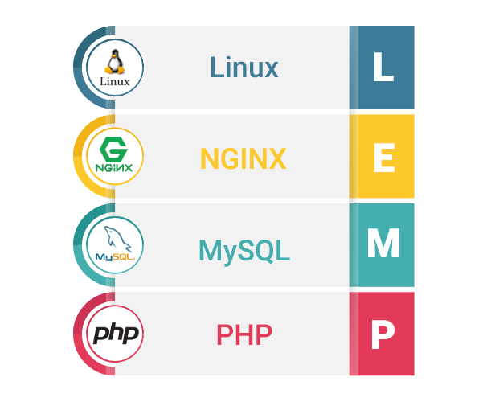

# Docker Compose LEMP

## Details

The following versions are used.

* letsencrypt-nginx-proxy-companion stable
* nginx-proxy alpine
* php 8.0.6-fpm-alpine3.13
* mysql 8.0.25
* phpmyadmin

## Configuration

You can also set the following environment variables, for example in the included `.env` file:

| Key | Description | Example |
|-----|-------------|---------|
|MYSQL_ROOT_PASSWORD|The MySQL root password used when creating the container.|root|
|PMA_ARBITRARY|when set to 1 connection to the arbitrary server will be allowed.|1|
|MYSQL_USER|The MySQL user used when creating the container.|root|
|MYSQL_PASSWORD|The MySQL user password used when creating the container.|root|
|MYSQL_DATABASE|This variable is optional and allows you to specify the name of a database to be created on image startup.|name|
|VIRTUAL_HOST|Sub domain|subdominio.ejemplo.com|
|LETSENCRYPT_HOST|Sub domain|subdominio.ejemplo.com|
|LETSENCRYPT_EMAIL|service and certification email|tumail@ejemplo.com|

## Usage

To use it, simply follow the following steps:

##### Clone this repository.

##### Copy App 

Copy the created application into the `/app` directory

##### Start the server.

Start the server using the following command inside the directory you just cloned: `docker-compose up -d`.

